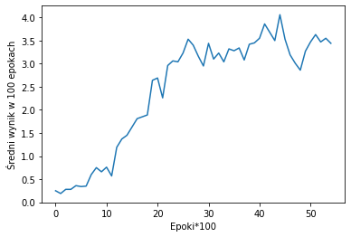

# Reinforcement Learning Snake

The aim of the project is to create an artificial neural network capable of playing a snake. I used Reinforcement Learning method to learn the network. 

## Game rules:
- snake can only move forward, left or right. Backwards moves are blocked,
- you win the game when the snake segments are on *every* segment of the gameboard,
- you lose if snake hit the border of the gameboard or eat itself.

## Python packeges used:
 - [pygame](https://www.pygame.org/) v. 2.0.0
 - [tensorflow](https://www.tensorflow.org/) v. 1.14.0
 - [numpy](https://numpy.org/) v. 1.19.3

## Repository contains several files:
- main.py -- it is the main file of the project, it is used to learn neural network to play,
- neural_network.py -- contains architecture of the neural network
- dqn.py -- contains agent's memory ,
- snake_environment.py -- contains the game environment, there are implemented all the game rules,
- test.py -- it is used for testing already trained neural network model,
- snke_condaenv.yml -- this is the Anaconda environment which is usefull to run the hole project, using appropriate versions of all required packages
- trained_model.py -- already trained model.

## What you can do here?
- just play the game by running snake_environment.py file :snake:
- train your own model by main.py. You can use default parameters or you can change it. :memo:
If you use deafult parameters you should get similar results to my:

