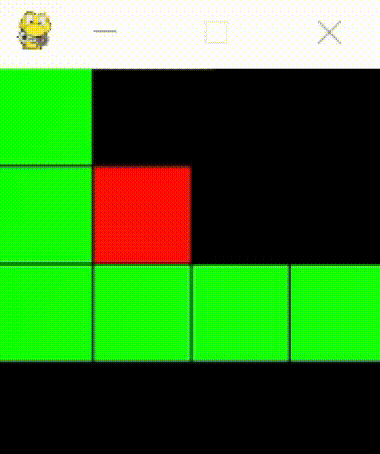

# Reinforcement Learning Snake

The aim of the project is to create an artificial neural network capable of playing a snake. I used Reinforcement Learning method to learn the network. 

## Game rules:
- snake can only move forward, left or right. Backwards moves are blocked,
- you win the game when the snake segments are on **every** segment of the gameboard,
- you lose if snake hit the border of the gameboard or eat itself.

## Python packeges used:
 - [pygame](https://www.pygame.org/) v. 2.0.0
 - [tensorflow](https://www.tensorflow.org/) v. 1.14.0
 - [numpy](https://numpy.org/) v. 1.19.3
 - [matplotlib](https://matplotlib.org/) v. 3.3.3

## Repository contains several files:
- main.py -- it is the main file of the project, it is used to learn neural network to play,
- neural_network.py -- contains architecture of the neural network
- dqn.py -- contains agent's memory ,
- snake_environment.py -- contains the game environment, there are implemented all the game rules,
- test.py -- it is used for testing already trained neural network model,
- snke_condaenv.yml -- this is the Anaconda environment contains appropriate versions of all required packeges,
- trained_model.py -- already trained model.

## What you can do here?
- just play the game by running snake_environment.py file :snake:
- train your own model by main.py (you can use my deafult parameters or set your own) :memo:
- you can test trained model by test.py (you can test your own model or test mine) :clipboard:

## How the snake can learn?
Reinforcement Learning is the machine learning method, in which the agent (snake) interacts with the environment (gameboard with snacks), based on the informations it collects about the environment (initially by randomly executing an action), selects an action (dirrection of the next move) in the environment and is rewarded or punished depending on the success of the action. Snake is rewarded for collecting a snack and punished for loosing the game. There is also leaving penalty to to prevent unsuspecting movements.

On input of the neural network there is the vision of the snake. Snake have vision in 8 different directions: North, North-East, East, South-East, South, South-West, West and North-West. On each direction snake 'looks' for three data: distance to the wall, distance to the potential snack and distance to the potetial snake-segment. In that way, there are 24 neurons on input to neural network. On output we have 4 neurons corresponding to 4 movements. There are 2 hidden layers, 18 neurons each. On hidden layers there is relu activation function and softmax activation on output layer.

 

## Results
I have trained my model on 4x4 gameboard (i wanted this not to take a lot of time) to the first win during training (score 1 points -- intial snake has 3 segments). The rewards was:
- positive: 1.0 point
- negative: -2.0 points
- livingPenalty: -0.02 point
During testing snake was able to score an average of 4.4 points on the 4x4 board with best score 13 points. The following chart shows how model has trained (mean score from last 100 games) and the gif shows how snake behave on 4x4 board (of course you can test how it will behave on bigger boards).

 

